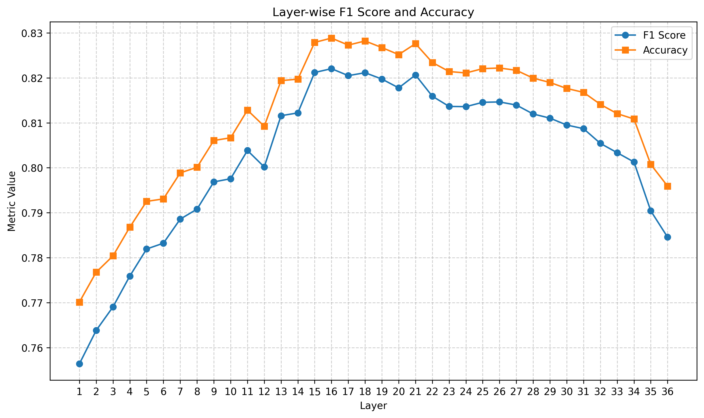

# Hallucination Detection via Internal Representations: An Empirical Study

---

**Abstract. —** This report summarizes a series of experiments investigating whether hallucination-related signals can be extracted from an LLM's internal representations. Using `Ministral-8B-Instruct-2410` as a case study, we constructed a dataset of 145,169 labeled examples spanning diverse domains and trained lightweight XGBoost probes on mean-pooled hidden states and attention features. Results indicate that hallucination-relevant information is indeed encoded in the model's activations, achieving approximately 83% accuracy, 91% AUC, and 75% F1 score. Notably, this signal is concentrated in specific mid-layers rather than distributed across the network, with layer 16 (of 36) proving most informative. Multi-layer concatenation and attention-based features yielded no substantial improvement over the single best-performing layer.

*The full experimental pipeline is documented in a series of [four notebooks](../notebooks).*

---

## 1. Introduction

Large language models occasionally generate plausible-sounding but factually incorrect content, a phenomenon commonly referred to as "hallucination". Current detection methods typically rely on external knowledge retrieval, self-consistency checks, or secondary judge models, each incurring significant computational overhead or introducing additional points of failure.

The hypothesis motivating this work is that language models may encode information about the reliability of their own outputs within their internal representations. If such signals exist and can be extracted, lightweight probes could enable real-time hallucination detection at minimal computational cost, without requiring external knowledge bases or additional inference passes.

We focus on Mistral's [Ministral-8B-Instruct-2410](https://huggingface.co/mistralai/Ministral-8B-Instruct-2410), a 36-layer transformer with 32 attention heads and a hidden dimension of 4096. This model was chosen for its moderate size, facilitating rapid experimentation and activation extraction on a single NVIDIA A100 GPU.

## 2. Dataset

A dedicated dataset was constructed for this research, now publicly available at [krogoldAI/hallucination-labeled-dataset](https://huggingface.co/datasets/krogoldAI/hallucination-labeled-dataset). The dataset comprises 145,169 labeled examples specifically generated by `Ministral-8B-Instruct-2410` at temperature 0.7, with an overall hallucination rate of 32.2%.

#### 2.1. Construction

The dataset aggregates prompts from six source datasets spanning diverse domains and tasks. For each prompt, `Ministral-8B-Instruct-2410` generated a response, which was then labeled for hallucination presence. Labeling was performed via judge LLM evaluation, except for one source dataset where deterministic comparison with ground truth answers was possible. Full details on source datasets as well as system prompts used for evaluation are provided in the dataset card.

#### 2.2. Design Considerations

Two deliberate choices shaped the dataset construction:

1. Same-model generation: All outputs were produced by the same model used for probing (`Ministral-8B-Instruct-2410`). This avoids confounding effects from out-of-distribution text, which could manifest as elevated perplexity and atypical activation patterns.

2. Balanced splits: The data is partitioned 70/15/15 into train, validation, and test sets, preserving per-source distribution and hallucination rates across splits to ensure consistent evaluation conditions.

## 3. Methodology

#### 3.1. Feature Extraction

Activations were extracted using `llmscan`, a lightweight library developed for this research. For each example, the model processed the full conversation (user prompt and assistant response) formatted according to Mistral's chat template. Crucially, only tokens corresponding to the assistant's response (following the `[/INST]` delimiter) were retained for feature extraction, ensuring the probe operates on the model's representation of its own output where hallucinations manifest.

Two types of features were extracted:

1. *Hidden state activations:* The output of the feed-forward network (FFN) at each layer, mean-pooled across assistant response tokens, yielding a 4096-dimensional vector per layer.

2. *Attention features:* For selected layers, we extracted both the multi-head attention (MHA) output (4096 dimensions) and per-head statistical summaries. For each of the 32 attention heads, 12 statistics were computed over the attention distribution:
   - Distributional measures: entropy, standard deviation, Gini coefficient, Simpson index
   - Concentration metrics: maximum attention weight, top-5 cumulative mass, top-10% cumulative mass, effective token count
   - Positional statistics: mean relative distance (average position attended to), attention mass on the beginning-of-sequence token
   - Shape measure: skewness
   - Global measure: Frobenius norm (capturing overall "energy" of the attention pattern)

   This yields 384 attention statistics per layer (12 metrics × 32 heads).

#### 3.2. Probe Architecture

All probes used XGBoost classifiers with consistent hyperparameters: 800 estimators, max depth 6, learning rate 0.05, 80% subsampling, and GPU-accelerated training. Early stopping (patience of 20 rounds) prevented overfitting. Decision thresholds were optimized on the validation set to maximize F1 score.

#### 3.3. Experimental Protocol

Experiments proceeded in four stages:

1. Layer selection: Train a simple probe on each layer's activations using validation data; rank layers by accuracy and F1 to identify the most expressive candidates.

2. Single-layer probing: Train a full probe on the best-performing layer using the complete training set.

3. Multi-layer probing: Concatenate activations from multiple top-performing layers; evaluate with and without feature selection.

4. Attention-based probing: Train probes on attention statistics and MHA outputs; evaluate hybrid approaches combining attention and activation features.

## 4. Results

#### 4.1. Layer Selection

The layer selection analysis revealed that mid-layers are most expressive for hallucination detection. Layers 16, 15, 18, and 21 consistently outperformed both early and late layers.

*Figure 1: Layer-wise probe performance (F1 and accuracy) across all 36 layers of* `Ministral-8B-Instruct-2410`.

This pattern admits an intuitive interpretation: early layers (1-10) encode primarily syntactic and surface-level features, while late layers (25–36) may be optimized for generation rather than factual grounding. Mid-layers appear to capture semantic representations where hallucination-relevant signals are most accessible.

#### 4.2. Single-Layer Results

Training on layer 16 alone yielded the following results:

| Threshold | Accuracy | Precision | Recall | F1 | AUC |
|:---------:|:--------:|:---------:|:------:|:--:|:---:|
| 0.5 (default) | 84.15% | 81.94% | 65.09% | 72.55% | 91.04% |
| 0.366 (optimized) | 82.96% | 72.49% | 75.87% | 74.13% | 91.04% |

Threshold optimization improves hallucination recall from 65% to 76% at modest cost to precision, which is a reasonable tradeoff given that missing hallucinations is typically more costly than occasional false positives. In any event, this already establishes that hidden states encode, at least partially, hallucination-related signals.

#### 4.3. Multi-Layer Results

Concatenating multiple layers yielded marginal improvements:

| Layers | Features | Threshold | Accuracy | Precision | Recall | F1 | AUC |
|:------:|:--------:|:---------:|:--------:|:---------:|:------:|:--:|:---:|
| 16 | All (4096) | 0.366 | 82.96% | 72.49% | 75.87% | 74.13% | 91.04% |
| 15, 16 | All (8192) | 0.388 | **83.75%** | **74.94%** | 74.35% | 74.65% | 90.99% |
| 15, 16 | Top 2500 | 0.371 | 83.49% | 73.53% | 76.07% | **74.78%** | 91.06% |
| 15, 16, 18 | All (12288) | 0.362 | 83.42% | 73.29% | 76.27% | 74.75% | **91.29%** |
| 15, 16, 18 | Top 4500 | 0.339 | 82.68% | 70.52% | **79.32%** | 74.66% | 91.25% |

Performance plateaus regardless of whether one, two, or three layers are used, with all configurations converging to approximately 74-75% F1, 83-84% accuracy, and 91% AUC. Feature selection reveals substantial redundancy across layer representations, suggesting that hallucination-related signals are concentrated rather than distributed. Overall, reducing dimensionality does not improve performance.

#### 4.4. Attention-Based Results

Attention features underperformed hidden state activations:

| Feature Type | Threshold | Accuracy | Precision | Recall | F1 | AUC |
|:------------:|:---------:|:--------:|:---------:|:------:|:--:|:---:|
| Attention statistics (384) | 0.350 | 79.90% | 66.79% | 74.80% | 70.55% | 88.46% |
| MHA output (4096) | 0.362 | 82.11% | 71.02% | 75.01% | 72.96% | 90.90% |
| Activations layer 16 (4096) | 0.366 | 82.96% | 72.49% | 75.87% | 74.13% | 91.04% |

Hybrid approaches combining activations with attention features showed no improvement over activations alone:

| Features | Threshold | Accuracy | Precision | Recall | F1 | AUC |
|:--------:|:---------:|:--------:|:---------:|:------:|:--:|:---:|
| Layers 15-16 activations + Layer 16 attention (All) | 0.376 | 83.35% | 73.52% | 75.44% | 74.47% | 90.91% |
| Same, Top 3000 | 0.379 | 83.36% | 73.76% | 74.97% | 74.36% | 90.98% |

## 5. Discussion

#### 5.1. Key Findings

Our results indicate that *hallucination-related signals are present and extractable from the model's internal representations*. The consistent 91% AUC across all configurations demonstrates that hallucination-relevant information is encoded in the model's internal representations and can be retrieved using lightweight probes. This finding supports the hypothesis that the model maintains, at least implicitly, some representation of the reliability of its own outputs.

Equally notable is that *these signals seem to be "localized", not distributed*. Indeed, performance does not improve with additional layers: the hallucination-related signal appears concentrated in specific mid-layers (particularly layer 16) rather than spread across the network. This concentration has practical implications: a single layer's activations suffice for detection, minimizing extraction overhead.

Moreover, attention features - both per-head statistics and MHA outputs - added no value beyond what FFN activations already provided. The discriminative information appears to reside primarily in the feed-forward pathway, suggesting that attention patterns, at least as summarized by our chosen statistics, do not capture complementary hallucination-relevant signals.

Finally, all configurations converge to similar performance bounds: approximately 75% F1, 83-84% accuracy, and 91% AUC. This ceiling may reflect fundamental limits to what can be extracted via mean-pooled representations, noise in the dataset labels, or both.

#### 5.2. Limitations and Future Directions

Several factors may account for the observed performance ceiling:

- *Pooling artifacts:* Mean-pooling may attenuate per-token signals. Retaining raw token-level activations and training a sequence-aware probe (e.g., a small transformer) could capture finer-grained patterns, though at the cost of the lightweight inference we sought to preserve.

- *Dataset quality:* Due to budget constraints, labels were assigned by judge LLMs without majority voting or human verification. While this enabled large-scale dataset construction, a non-negligible false positive/negative rate may impose an upper bound on achievable performance regardless of probe sophistication.

- *Fundamental limits:* The hallucination signal encoded in activations may be inherently partial or may not align perfectly with standard definitions of factual hallucination.

Additional approaches explored but not detailed here - including alternative pooling strategies (max-pooling, attention-weighted pooling), alternative classifiers (random forests, logistic regression, neural probes), probe ensembling, and PCA dimensionality reduction - yielded no improvements. Mean-pooling with XGBoost consistently performed best.

A reasonable next step for improving absolute performance could be dataset refinement: retraining probes on a curated subset with human-verified labels or robust majority voting could establish a cleaner signal and tighter performance bounds.

## 6. Conclusion

This study demonstrates that hallucination-related signals are present and extractable from transformer internal representations using lightweight classical probes. A single mid-layer's mean-pooled activations suffice to achieve 91% AUC and 75% F1 score, suggesting that the model encodes, at least implicitly, information about the reliability of its own outputs. While the observed performance ceiling leaves room for improvement, these findings provide a foundation for real-time, low-overhead hallucination detection and offer interpretability insights into how factual grounding may be represented within language models.

## Resources

- **Dataset:** [krogoldAI/hallucination-labeled-dataset](https://huggingface.co/datasets/krogoldAI/hallucination-labeled-dataset)
- **Code:** [llmscan library](https://github.com/julienbrasseur/llm-hallucination-detector)
- **Model:** [Ministral-8B-Instruct-2410](https://huggingface.co/mistralai/Ministral-8B-Instruct-2410)

